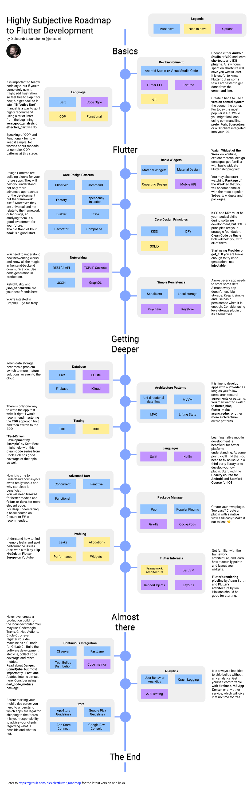

# flutter学习路线

引用于https://github.com/olexale/flutter_roadmap

#### Dev Environment

- [https://learngitbranching.js.org](https://learngitbranching.js.org/)

#### Language

- https://dart.dev/guides/language/language-tour
- https://dart.dev/guides/language/effective-dart

#### Basic Widgets

- https://flutter.dev/docs/development/ui/widgets-intro
- https://www.youtube.com/watch?v=b_sQ9bMltGU&list=PLjxrf2q8roU23XGwz3Km7sQZFTdB996iG
- [http://material.io](http://material.io/)
- https://developer.apple.com/design/

#### Core Design Patterns

- https://en.wikipedia.org/wiki/Design_Patterns

#### Core Design Principles

- https://en.wikipedia.org/wiki/KISS_principle
- [https://en.wikipedia.org/wiki/Don%27t_repeat_yourself](https://en.wikipedia.org/wiki/Don't_repeat_yourself)
- https://en.wikipedia.org/wiki/SOLID
- [https://cleancoders.com](https://cleancoders.com/)
- https://pub.dev/packages/provider
- https://pub.dev/packages/get_it

#### Networking

- https://en.wikipedia.org/wiki/Representational_state_transfer
- https://pub.dev/packages/chopper
- https://pub.dev/packages/json_serializable

#### Simple Persistence

- https://pub.dev/packages/localstorage
- https://pub.dev/packages/flutter_keychain

#### Database

- https://pub.dev/packages/sqflite
- https://pub.dev/packages/firebase
- https://pub.dev/packages/moor
- https://pub.dev/packages/hive

#### Architecture

- [https://fluttersamples.com](https://fluttersamples.com/)
- https://pub.dev/packages/flutter_redux
- https://pub.dev/packages/flutter_mobx
- https://pub.dev/packages/flutter_bloc

#### Testing

- https://en.wikipedia.org/wiki/Test-driven_development
- https://en.wikipedia.org/wiki/Behavior-driven_development
- https://www.amazon.com/Test-Driven-Development-Kent-Beck/dp/0321146530

#### Languages

- https://www.udacity.com/course/developing-android-apps-with-kotlin--ud9012
- [https://cs193p.sites.stanford.edu](https://cs193p.sites.stanford.edu/)

#### Dart

- https://pub.dev/packages/freezed
- [https://fsharpforfunandprofit.com](https://fsharpforfunandprofit.com/)

#### Package Manager

- https://flutter.dev/docs/development/packages-and-plugins/developing-packages
- [https://cocoapods.org](https://cocoapods.org/)
- [https://maven.apache.org](https://maven.apache.org/)

#### Profiling

- https://flutter.dev/docs/perf/rendering/ui-performance
- https://youtu.be/vVg9It7cOfY

#### Flutter Internals

- https://youtu.be/UUfXWzp0-DU
- https://youtu.be/dkyY9WCGMi0
- http://www.cs.cmu.edu/~bam/uicourse/830spring20/05-830-2020-03-23-Lecture-10-Flutter.mp4
- https://mrale.ph/dartvm/

#### Continuous Integration

- [https://fastlane.tools](https://fastlane.tools/)
- [https://danger.systems](https://danger.systems/)
- [https://www.sonarqube.org](https://www.sonarqube.org/)
- https://codemagic.io/
- [https://travis-ci.org](https://travis-ci.org/)

#### Analytics

- https://firebase.google.com/docs/analytics
- https://docs.microsoft.com/en-us/appcenter/analytics/

#### Store

- https://developer.apple.com/app-store/review/guidelines/
- https://play.google.com/about/developer-content-policy/
- https://developer.android.com/distribute/best-practices/launch/launch-checklist

## Highly Subjective Roadmap to Flutter Development

by Oleksandr Leuschenko (@oleaxe)

## Basics

- **Dev Environment**

  - Android Studio or Visual Studio Code (Must have)
  - Flutter CLI (Nice to have)
  - Git (Nice to have)
  - DartPad (Optional)

  Choose either **Android Studio** or **VSC** and learn **shortcuts** and IDE **plugins**. A few hours spent on shortcuts will save you weeks later.It is useful to know Flutter CLI as some tasks are faster to get done from the command line.

  Create a habit to use a version control system the sooner the better. For today the most popular is Git. While you might look cool using command line, prefer **Fork**, **Sourcetree**, or Git client integrated into your **IDE**.

- **Language**

  - Dart (Must have)
  - OOP (Nice to have)
  - Functional (Nice to have)
  - Code Style (Optional)

  It is important to follow code style, but if you’re completely new it might add frustration, so feel free to skip it for now, but get back to it later. “Effective Dart” manual is a way to go. Speaking of OOP and Functional - for now, keep it simple. No worries about monads or complex OOP patterns at this stage.

## Flutter

- **Basic Widgets**

  - Material Widgets (Must have)
  - Material Design (Must have)
  - Cupertino Design (Nice to have)
  - Mobile HIG (Optional)

  Watch **Widget of the Week** on Youtube, explore material design concepts, get familiar with basic widgets Flutter shipping with.

- **Core Design Patterns** (Must have)

  - Observer
  - Command
  - Dependency Injection
  - State
  - Composite
  - Factory
  - Builder
  - Decorator

  Design Patterns are building blocks for your future apps. They will help you understand not only more advanced approaches for the development but the framework itself. Moreover, they are universal and not relate to the framework or language, so studying them is a good investment for your future. The old **Gang of Four book** is a good start.

- **Core Design Principles**

  - KISS (Must have)
  - DRY (Must have)
  - SOLID (Nice to have)

  KISS and DRY must be your tactical skills during software development, but SOLID principles are your strategic foundation. **Clean Code by Uncle Bob** will help you with all of them.Start using **Provider** or **get_it**.

- **Networking**

  - RESTful API (Must have)
  - JSON (Must have)
  - TCP/IP Sockets (Optional)

  You need to understand how networking works and know all the magic in frontend-backend communication. Use code generation in production.

  **Chopper** and **json_serializable** are your best friends here.

- **Simple Persistence**

  - Serializers (Must have)
  - Local storage (Must have)
  - Keychain (Optional)
  - Keystore (Optional)

  Almost every app needs to store some data. Almost every app doesn’t need big storage. Keep it simple and use basic persistence when it is enough. Consider using **localstorage** plugin or its alternatives.

## Getting Deeper

- **Database**

  - SQLite (Must have)
  - Firebase (Must have)
  - Moor (Optional)
  - iCloud (Optional)

  When data storage becomes a problem - switch to more mature solutions, or even to the cloud.

- **Architecture** (Must have)

  - Redux
  - MVC
  - Lifting State
  - MVVM

  It is fine to develop apps with a **Provider** as long as you follow some architectural agreements or patterns. You may want to switch to **Redux**, **MobX**, **BloC**, or other more architecture-aware patterns.

- **Testing**

  - TDD (Must have)
  - BDD (Nice to have)

  There is only one way to write the app fast - write it right. I would recommend mastering the **TDD** approach first and then switch to the **BDD**. “**Test-Driven Development by Example**” by Kent Beck might help with this. Clean Code series from Uncle Bob has good coverage of the topic as well.

- **Languages** (Optional)

  - Swift
  - Kotlin

  Learning native mobile development is beneficial for better platform understanding. At some point you’ll find that you need to fix an issue in a third-party library or to develop your own plugin. Start with the **Udacity course for Android** and **Stanford Course for iOS**.

- **Dart** (Must have)

  - Concurrent
  - Reactive
  - Functional

  Now it is time to understand how async/await really works, what is monad, why stateless is beneficial. You may try **freezed** here. For deep understaning, a basic course on Closure or F# is recommended.

- **Package Manager**

  - Pub (Must have)
  - Popular Plugins (Must have)
  - Maven (Optional)
  - CocoaPods (Optional)

  Create your own plugin. Too easy? Create a plugin with a native view. Still easy? Make it not to leak 🙂

- **Profiling**

  - Leaks (Must have)
  - Allocations (Nice to have)
  - Performance (Nice to have)
  - Widgets (Nice to have)

  At least understand how to find memory leaks, but performance issues hunting is worth it as well. Start with a talk by **Filip Hráček** on **Flutter Europe** on Youtube.

- **Flutter Internals**

  - Framework Architecture (Nice to have)
  - Dart VM (Optional)
  - RenderObjects (Optional)
  - Layouts (Optional)

  Get familiar with the framework architecture, and learn how it actually paints and layout your widgets.

  **Flutter's rendering pipeline** by Adam Barth and **Flutter's architecture** by Ian Hickson should be good for starting.

## Almost there

- **Continuous Integration**

  - CI server (Must have)
  - Test Builds Distribution (Must have)
  - FastLane (Must have)
  - Code metrics (Optional)

  Never ever create production builds from the local dev folder. You may use Codemagic, Travis, GitHub Actions, Circle CI, or (in the worst scenario) register your dev machine as a CI node. Build the software development lifecycle, collect code coverage and other metrics. Read about **Danger**, **SonarQube**, but most importantly - **FastLane**.

- **Analytics**

  - User Behavior Analytics (Must have)
  - Crash Logging (Must have)
  - A/B Testing (Optional)

  It is always a bad idea to ship builds without any analytics. Get yourself comfortable with **Firebase**, **MS App Center**, or any other service, which will give it at no time for free.

- **Store** (Must have)

  - AppStore Guidelines
  - Google Play Guidelines
  - App Store Connect
  - Google Dev Console

  Before starting your mobile dev career you need to understand which apps are legal for shipping to the Stores. It is your responsibility to advise your clients regarding what is possible and what is not.